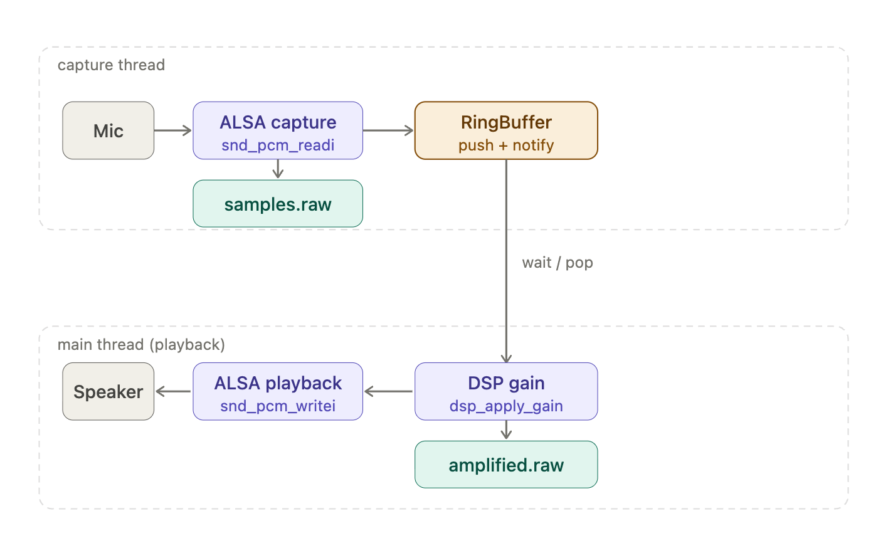

# ALSA Audio Pipeline (Linux)

A small C++ project demonstrating a real-time audio processing pipeline on Linux using the ALSA API. This is great for those learning how to use ALSA in Linux.

The program captures microphone audio, passes samples through a producer/consumer ring buffer, applies a simple DSP stage, and renders playback — all in a threaded pipeline.

This repository explores low-level Linux audio behavior, real-time buffering, and systems programming techniques commonly used in embedded audio and voice processing systems.

## Features

- ALSA PCM capture and playback
- Producer/consumer ring buffer architecture
- Multithreaded audio pipeline
- Frame-based processing (20 ms frames)
- Real-time buffering behavior and underrun handling
- Ring buffer stress testing
- Memory validation using Valgrind
- ALSA device enumeration

## Quick Start

Build:

```bash
make
```

Run the audio pipeline:

```bash
./alsarb
```

List available ALSA audio devices:

```bash
./alsarb list-devices
```

Run the ring buffer stress test:

```bash
./alsarb test-ring
```

---
## Why This Project Exists

This project was built to explore the low-level Linux audio stack using ALSA and to experiment with real-time audio buffering behavior.

The goal was to create a minimal but realistic audio pipeline that captures microphone input, moves data through a producer/consumer ring buffer, and plays it back with minimal latency.

The project focuses on understanding:

- ALSA PCM capture and playback
- Real-time buffering behavior in Linux audio systems
- Thread coordination between capture and playback pipelines
- Latency and underrun behavior in simple audio pipelines

This type of architecture is common in embedded voice systems, conversational AI devices, and real-time audio processing applications.

## What This Demonstrates

This repository demonstrates several core systems programming skills:

- C++ systems programming in a Linux environment
- Direct interaction with the ALSA audio subsystem
- Producer/consumer concurrency using a ring buffer
- Thread coordination and synchronization
- Real-time streaming data pipelines
- Debugging raw PCM audio artifacts

The design reflects patterns commonly used in embedded Linux audio systems, voice-interface devices, and low-latency media processing pipelines.

## Pipeline

<p align="center">
  <a href="docs/alsa-audio-pipeline.png">
    
  </a>
  <br>
  <em>ALSA capture → ring buffer → DSP gain → playback pipeline</em>
</p>

Two threads run concurrently, decoupled by a ring buffer:

```
CAPTURE THREAD
  Mic → ALSA capture (snd_pcm_readi) → samples.raw → RingBuffer (push)

PLAYBACK THREAD
  RingBuffer (wait/pop) → DSP gain → amplified.raw → ALSA playback (snd_pcm_writei) → Speaker
```

The ring buffer is the synchronization boundary between threads. The capture thread pushes samples and signals via a condition variable. The playback thread blocks until a full processing frame is available, then pops, processes, serializes, and renders it.


## Threading Model

| Thread | Responsibilities |
|---|---|
| Capture thread | `snd_pcm_readi` → write `samples.raw` → `RingBuffer::push` → `notify_one` |
| Main thread (playback) | `cond_var wait` → `RingBuffer::pop` → `dsp_apply_gain` → write `amplified.raw` → `snd_pcm_writei` |

Shared state between threads:

- `RingBuffer<int16_t>` — the sample queue
- `std::mutex` — protects ring buffer access
- `std::condition_variable` — playback thread sleeps until data is available
- `std::atomic<bool> capture_done` — signals playback thread to drain and exit

## Files

### `main.cpp`

Single-file implementation of the full pipeline. Contains all helper functions and `main()`.

Helper functions:

```
audio_open_device()   — opens an ALSA PCM device for capture or playback
cap_read_buffer()     — reads frames from ALSA; handles overrun (EPIPE)
rend_write_buffer()   — writes frames to ALSA; handles underrun (EPIPE)
rb_push_samples()     — pushes captured samples into the ring buffer
rb_pop_frame()        — pops a fixed-size frame from the ring buffer
dsp_apply_gain()      — applies gain with int16 saturation clamping
file_write_samples()  — writes raw PCM samples to a file
```

### `ringbuffer.hpp`

Templated circular buffer. Fixed capacity, non-blocking push/pop, head/tail indices with modulo wrap. One slot intentionally unused to distinguish full from empty.

```cpp
RingBuffer<int16_t> rb(8192);
rb.push(sample);
rb.pop(sample);
rb.size();
```

## Audio Format

| Property | Value |
|---|---|
| Sample format | Signed 16-bit little-endian (S16_LE) |
| Sample rate | 16,000 Hz |
| Channels | Mono |
| Frame size | 320 samples |
| Frame duration | 20 ms |

The 20 ms frame size (320 samples at 16 kHz) is common in speech-processing systems such as VAD, VoIP, and ML inference pipelines. At this frame size, scheduler jitter on non-real-time Linux kernels can occasionally cause playback underruns.

## Latency

Each processing frame contains 320 samples at 16 kHz, corresponding to 20 ms of audio per frame.

Because capture, buffering, processing, and playback operate on these frames, the end-to-end pipeline latency is approximately one frame plus any additional buffering required by the audio device.

Frame sizes in the 10–20 ms range are widely used in speech and voice-processing systems because they provide a practical balance between responsiveness and processing efficiency.

## Build

Install ALSA development headers if needed:

```
sudo apt install libasound2-dev
```

Compile debug build:

```
make
```

Compile release build:

```
make release
```

Clean:

```
make clean
```

---

## Running

```
./alsarb
```

The program counts down, then captures approximately 4 seconds of audio. Console output is throttled to every 5 iterations to avoid disturbing timing.

## Output Files

Two raw PCM files are written for debugging and validation:

**`samples.raw`** — raw captured audio, written by the capture thread immediately after `snd_pcm_readi`.

**`amplified.raw`** — processed audio written by the playback thread after `dsp_apply_gain`, recording exactly what was sent to the speaker.

Play them back with `aplay`:

```
aplay -f S16_LE -r 16000 -c 1 samples.raw
aplay -f S16_LE -r 16000 -c 1 amplified.raw
```

## DSP Stage

The current DSP stage applies a linear gain:

```
output_sample = clamp(input_sample × gain, -32768, 32767)
```

Clamping prevents integer overflow distortion at the int16 boundary. This stage is a placeholder — it can be replaced with filters, noise suppression, VAD, or ML inference without changing the pipeline architecture.

## ALSA Functions

| Function | Purpose |
|---|---|
| `snd_pcm_open` | Open capture or playback device |
| `snd_pcm_hw_params_*` | Configure format, rate, channels, period size |
| `snd_pcm_prepare` | Prepare device for streaming |
| `snd_pcm_readi` | Read captured audio frames |
| `snd_pcm_writei` | Write playback audio frames |
| `snd_pcm_drain` | Flush playback before shutdown |
| `snd_pcm_close` | Close device |

EPIPE (overrun on capture, underrun on playback) is handled by calling `snd_pcm_prepare` and continuing.

## Startup Behavior

Before audio capture begins the program performs a short audible countdown:

'''code
Starting capture in 3…
Starting capture in 2…
Starting capture in 1…
GO
'''

During the countdown the program plays simple synthesized tones using ALSA playback. These tones provide an audible cue before recording begins.

The tones are generated by synthesizing a short sine wave:

'''code
sample = sin(phase) * amplitude
'''

This audio path is separate from the main capture/playback pipeline and exists only to provide user feedback before recording starts. It also provides a simple example of UI-oriented playback that is distinct from the real-time capture/process/playback path.

## Automated Testing

Two helper scripts are included to validate the behavior of the application and verify memory correctness.

### Mode Tests

The script `test_modes.sh` exercises all supported command-line modes of the program.

Run:

```bash
./test_modes.sh
```

Example output:

```text
Building project...
g++ -Wall -Wextra -std=c++17 -g -O0 main.cpp -o alsarb -lasound

Running mode tests...

---------------------------------
Test: default pipeline mode
Starting capture in 3...
Starting capture in 2...
Starting capture in 1...
GO

Capture device:          plughw:2,0
Capture sample rate:     16000
Playback sample rate:    16000
Channels:                1
Capture frames/buffer:   320
Playback frames/buffer:  320
Processing frame size:   320
Ring capacity:           8192
Gain:                    1.5
Iterations:              200

[main.cpp:446] [capture] iteration 0: captured 320 frames
[main.cpp:487] [playback] processed frame 10
...
[main.cpp:446] [capture] iteration 190: captured 320 frames
[main.cpp:487] [playback] processed frame 200
PASS

---------------------------------
Test: help (--help)
PASS

---------------------------------
Test: help (-h)
PASS

---------------------------------
Test: list-devices
Available ALSA PCM devices:
  null
  default
  pulse
  plughw:CARD=PCH,DEV=0
  plughw:CARD=P420,DEV=0
  ...
PASS

---------------------------------
Test: ring buffer stress test
Running ring buffer stress test...
Ring buffer test passed (1000000 iterations)
PASS

---------------------------------
Test: unknown mode (should fail)
Unknown mode: nonsense
PASS

---------------------------------
All mode tests completed.
```

This script validates:

- Default ALSA audio pipeline execution
- Help output (`--help` and `-h`)
- ALSA device enumeration (`list-devices`)
- Ring buffer stress test (`test-ring`)
- Error handling for unknown commands

### Memory Testing with Valgrind

The script `test_valgrind.sh` runs the ring buffer stress test under Valgrind to detect memory leaks or invalid memory access.

Run:

```bash
./test_valgrind.sh
```

If Valgrind is not installed:

```bash
sudo apt update
sudo apt install valgrind
```

Example output:

```text
Running ring buffer stress test...
Ring buffer test passed (1000000 iterations)

HEAP SUMMARY:
    in use at exit: 0 bytes in 0 blocks
    total heap usage: 3 allocs, 3 frees, 77,824 bytes allocated

All heap blocks were freed -- no leaks are possible
ERROR SUMMARY: 0 errors from 0 contexts
```

This confirms that the ring buffer implementation executes correctly and completes without memory leaks.


## Current Limitations

This is an intentionally minimal audio pipeline and does not yet include several
features typically required in production voice systems.

Current limitations include:

- No echo cancellation (AEC), so speaker playback may feed back into microphone capture
- No noise suppression
- No automatic gain control (AGC)
- No voice activity detection (VAD)
- Limited latency tuning and underrun recovery

As a result, playback quality may sound rough or echo-prone during open-air testing.

## Next Steps

Planned improvements include:

- Add acoustic echo cancellation (AEC)
- Improve latency tuning and ALSA buffer configuration
- Add WAV capture for easier debugging and analysis
- Add command-line control for frame size, gain, and device selection
- Explore integration with higher-level Linux audio stacks

## Possible Extensions

- Voice activity detection (VAD) within the DSP stage
- Echo cancellation using playback reference signal
- Streaming frames to external inference APIs (e.g., OpenAI Realtime API)
- Lock-free ring buffer implementation using `std::atomic` head/tail
- Configurable devices and parameters via command line
- WAV file output with header support
